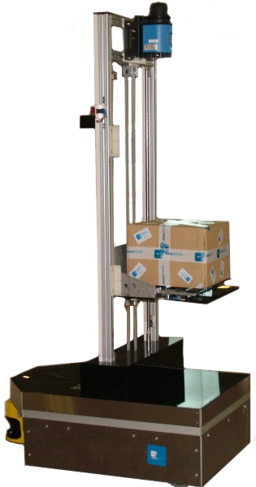
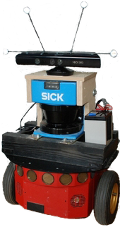
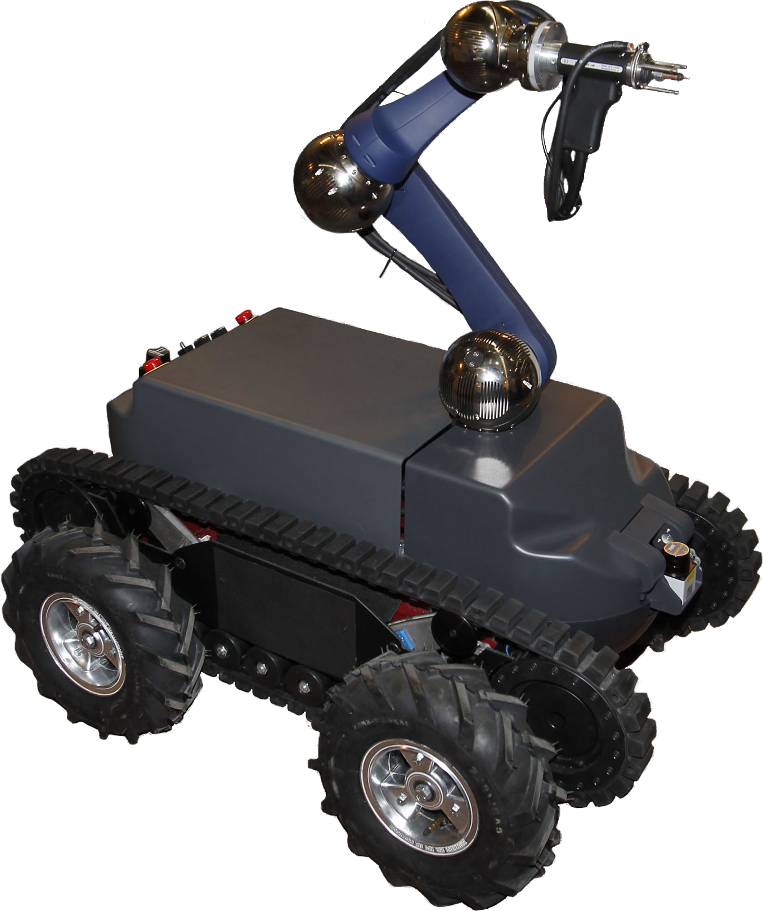
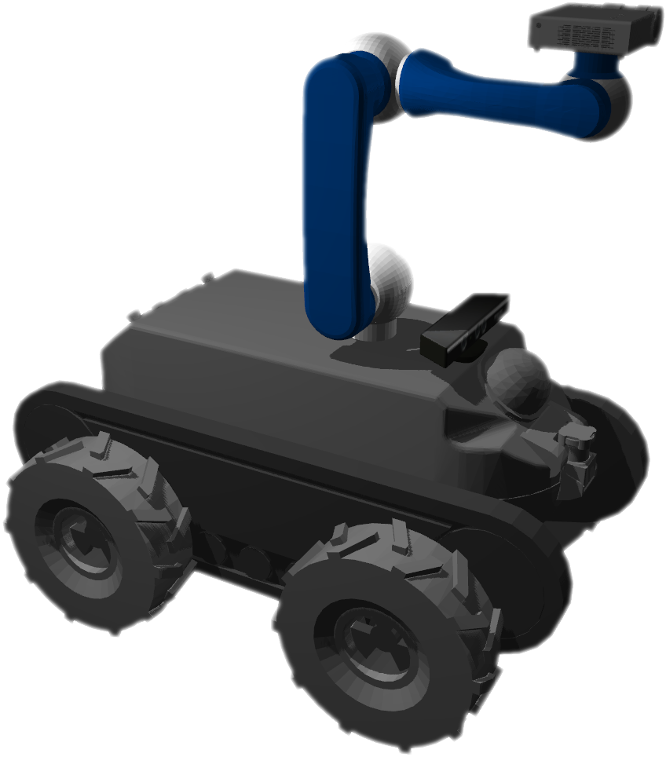
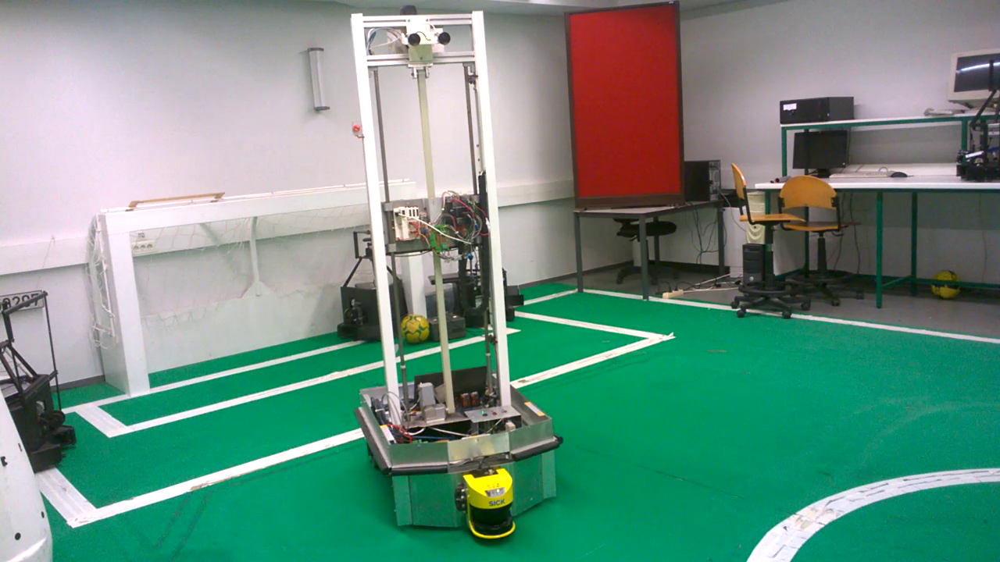
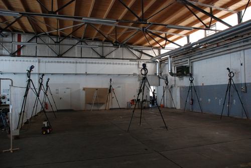
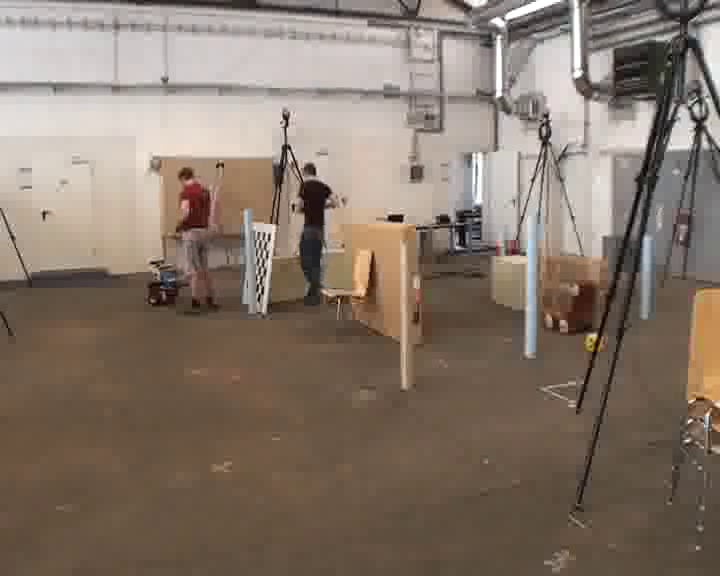
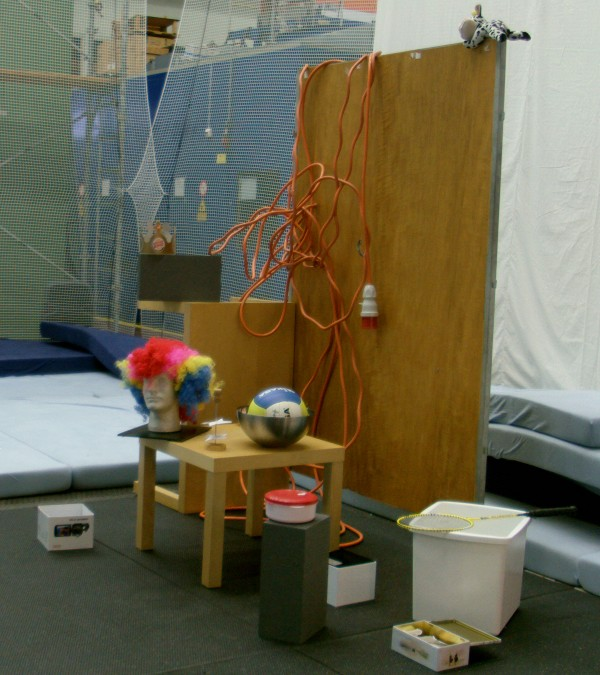
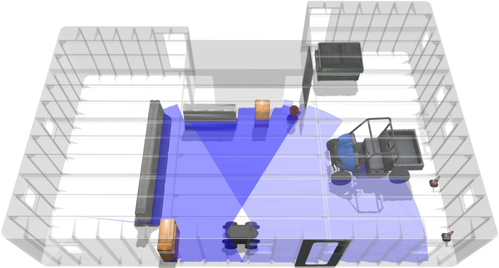

Dynamic Robot Localization tests
================================

## Overview

The dynamic_robot_localization_tests is a ROS package that aims to test the ROS [dynamic_robot_localization](https://github.com/carlosmccosta/dynamic_robot_localization) package (or any other localization system that relies in laser / point cloud sensor data).

The main testing configurations are managed in [launch/localization_tests.launch](launch/localization_tests.launch) and are specialized for each environment / bag in [launch/environments](launch/environments).

The localization_tests.launch file can be customized to change the localization system that is going to be tested.

They can use [rosbags](datasets) or live sensor data from the Gazebo simulator  (rosbag play started with --pause --> press space bar to start publishing msgs).

The test results along with environment screenshots / videos are available in [this shared folder](https://www.dropbox.com/sh/nwb6gezj2dan187/AABM2u4BGd12lN__nYFwSktLa?dl=0)


## Testing platforms

The localization system was tested on laser sensor data retrieved from three different robots and executed on the same computer in order to allow direct comparison of computation time. This computer was a Clevo P370EM3 laptop with a Intel Core i7 3630QM CPU at 2.4GHz, 16 GB of RAM DDR3, NVidia GTX680M graphics card and a Samsung 840 Pro SSD.

The sensor data was recorded into rosbags, and is publicly available in the [datasets folder](datasets).

The hardware specifications of the lasers used along with all the detailed results and experiments videos are available in [this shared folder](https://www.dropbox.com/sh/nwb6gezj2dan187/AABM2u4BGd12lN__nYFwSktLa?dl=0).


### Jarvis platform

The Jarvis platform is an autonomous ground vehicle equipped with a SICK NAV 350 laser for self-localization (mounted about 2 meters from the floor) and a SICK S3000 laser for collision avoidance (mounted about 0.20 meters from the floor). It uses a tricycle locomotion system with two back wheels and a steerable wheel at the front. In Fig. 1 the robot is performing a delivery task with the package on top of a moving support. The 3 DoF ground truth was provided by the SICK NAV350 system and relied on 6 laser reflectors (with 9 cm of diameter) to perform the pose estimations (it is certified for robot docking operations with precision up to 4 millimeters).



```
Figure 1: Jarvis robot
```


### Pioneer 3-DX

The Pioneer 3-DX shown in Fig. 2 is a small lightweight robot equipped with a SICK LMS-200 laser (mounted about 48 cm from the floor) and a Kinect (mounted about 78 cm from the floor). It uses a two-wheel two-motor differential drive locomotion system and can reach a linear speed of 1.2 m/s and angular velocity of 300º/s. The 3 DoF ground truth was provided by 8 Raptor-E cameras and according to [RGB-D SLAM Dataset and Benchmark](http://vision.in.tum.de/data/datasets/rgbd-dataset), it had less than 1 cm in translation error and less than 0.5 degrees in rotation error.



```
Figure 2: Pioneer 3-DX robot
```


### Guardian platform

The Guardian platform is an autonomous mobile manipulator equipped with a Hokuyo URG-04LX laser in the front and a Hokuyo URG-04LX_UG01 laser in the back (both mounted about 0.37 meters from the ground). The front laser had a tilting platform which allows 3D mapping of the environment. The arm is a SCHUNK Powerball LWA 4P and in Fig. 4 it is attached to a stud welding machine (in simulation it is attached to a video projector). It uses a differential drive locomotion system and can be moved with wheels or with tracks. This platform didn't have a certified ground truth and as such, the results could not be quantified with an external localization system (the results performed with the Gazebo simulator will be presented instead - robot model shown in Fig. 4).



```
Figure 3: Guardian robot
```



```
Figure 4: Guardian robot Gazebo simulator
```


## Testing environments

The localization system was tested in different environments and used the Jarvis platform in a large room with a RoboCup field, the Pioneer 3-DX in a large industrial hall, the Guardian platform in a simulated indoor environment and a Kinect in a flying arena.

### Jarvis in robocup field

The RoboCup field (shown in Fig. 5) occupies half of a large room (with 20.5 meters of length and 7.7 meters of depth). It has two doors, several small windows and two large glass openings into the hallway. Several tests were performed with the robot at speeds ranging from 5 cm/s to 50 cm/s in this environment and up to 2 m/s using the Stage simulator. These tests were performed with two different movement paths. The first is a simple rounded path that aimed to test the robot in the region of space that had better ground truth (due to its position in relation to the laser reflectors). The second path was more complex and contained several sub paths with different velocities and shapes. It was intended to evaluate the localization system with typical movements that mobile manipulators require, such as moving forward and backwards with or without angular velocity and stopping at the desired destination.

Launch files with synchronized ground truth available in [this folder](launch/environments/crob_lab/jarvis/bags)

Rosbags available in [this folder](datasets/crob_lab/jarvis).

Maps available in [this folder](maps/crob_lab/planar).



```
Figure 5: Jarvis testing environment
```


### Pioneer in industrial hall

The industrial hall is a large room with several tables and objects spread around. Four tests were performed with the Pioneer in this environment. The first was a 360º path with few objects in the middle of the room (shown in Fig. 6), while the remaining 3 were done with a lot of large objects that significantly reduced the field of view of the robot laser (as can be seen in Fig. 7).

The rosbags present in [this folder](datasets/tum) only have laser data, and the [associated launch files](launch/environments/tum/bags) corrected the TF tree and synchronized the ground truth with the laser time stamps.

The original bag files are available at [RGB-D SLAM Dataset and Benchmark](http://vision.in.tum.de/data/datasets/rgbd-dataset) (special thanks to the team who made this extensive dataset).

Maps available in [this folder](maps/tum/freiburg2_pioneer_slam).



```
Figure 6: Industrial hall
```



```
Figure 7: Industrial hall with objects in the middle
```


### Kinect in flying arena

The flying arena shown in Fig. 8 is a large room in which several objects were added to test 6 DoF pose tracking. In these tests the Kinect was moved by the operator in three different paths. The first was a smooth fly movement over the testing scene, while the other two aimed to test paths with mainly translations and rotations. This environment had a ground truth provided by Vicon cameras and according to the [authors of the dataset](http://projects.asl.ethz.ch/datasets/doku.php?id=kinect:iros2011kinect) it had sub-centimeter accuracy.

Launch files available in [this folder](launch/environments/asl/bags) (requires the download of the kinect rosbags from the [ASL datasets webpage](http://projects.asl.ethz.ch/datasets/doku.php?id=kinect:iros2011kinect) and move then to [this folder](datasets/asl/ethzasl_kinect_dataset)).

Maps available in [this folder](maps/asl/ethzasl_kinect_dataset).

Special thanks to the ASL team who made this dataset.



```
Figure 8: Flying arena environment
```


### Guardian in ship interior

The structured environment simulated in Gazebo is a large room with 12.4 meters of length and 8.4 meters of depth. It has 4 doors, several small windows and the walls have small ledges at regular intervals (as can be seen in FIg. 9).
Given that the Guardian mobile manipulator is expected to work on the walls of this environment, several tests were devised with a path following the lower and right wall of the environment. The first test was done in a static environment clear of unknown objects and was meant to evaluate the best precision that the localization system could achieve. The second test was done in a cluttered environment and was designed to test the robustness of the localization system against static unknown objects, that were placed in the middle of the environment and close to the walls (to block sensor data from reaching known positions and analyze the robustness of matching unknown points that are close to known areas). The last test added a moving car to the scene and aimed to assess the impact of dynamic objects on the point cloud registration algorithms.

Launch files available in [this folder](launch/environments/ship_interior).

Rosbags available in [this folder](datasets/ship_interior).

Maps available in [this folder](maps/ship_interior).



```
Figure 9: Guardian testing environment
```


## List of related git repositories:

* [dynamic_robot_localization](https://github.com/carlosmccosta/dynamic_robot_localization)
* [pose_to_tf_publisher](https://github.com/carlosmccosta/pose_to_tf_publisher)
* [laserscan_to_pointcloud](https://github.com/carlosmccosta/laserscan_to_pointcloud)
* [mesh_to_pointcloud](https://github.com/carlosmccosta/mesh_to_pointcloud)
* [robot_localization_tools](https://github.com/carlosmccosta/robot_localization_tools)
* [crob_gazebo_models](https://github.com/carlosmccosta/crob_gazebo_models)
* [octomap_mapping](https://github.com/carlosmccosta/octomap_mapping)


## More info

* [ICIT 2015 paper](https://www.dropbox.com/sh/yizj93xtvsapl9e/AABdCPKrMX2V58vzpzECKiExa?dl=0)
* [Results folder](https://www.dropbox.com/sh/nwb6gezj2dan187/AABM2u4BGd12lN__nYFwSktLa?dl=0)
* [Dissertation webpage](http://carlosmccosta.wix.com/personal-webpage#!dissertation/c12dl)
* [Dissertation abstract](http://1drv.ms/1odZRYO)
* [Research](http://1drv.ms/1l8yGei)
